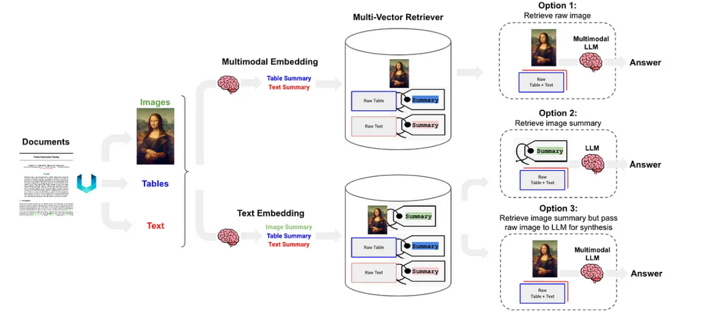

## Types of relation databases
1) SQL Server
2) PostgreSQL
3) MySQL
### Advantage of using Relation Databases:
- Enforce data integrity 
### Disadvantage of using Relation Databases:
- Multiple joins of different entities needs to be made, slows down data retrival process. 

**Good Resources**
https://gautam75.medium.com/multi-modal-rag-a-practical-guide-99b0178c4fbb 

## Types of Schemaless db
1) MongoDB

## Graph Database
1) Neo4j
perks of using Graph Database

What are labels:
- They classify the nodes

# Understanding common functions and syntax
--------------------------------------------------
MERGE (m:Movie {title: "Arthur the King"})  # assign variable m to Movie, specifically {title:} # specify the name and value for the property that will be the primary key for the node

SET m.year = 2024  # Set the property of m specifically year to 2024

RETURN m  

----------------------------------------------
MATCH (m:Movie)  

WHERE m.released IS NOT NULL   # MATCH is used with WHERE for filtering

RETURN m.title AS title, m.url AS url, m.released AS released  

ORDER BY released DESC LIMIT 5  

------------------------------------------------------------
MATCH (p:Person)-[:ACTED_IN]->(m:Movie)  

WHERE m.title = "As Good as It Gets" and p.born > 1960  

RETURN p.name as name

-------------------------------------------------------------

SET clause helps you to create, add, or remove by setting it to null  
MERGE clause helps us to add a property or create a relationship (match both or match and where clause)
NOTE: when using MERGE clause for defining a relationship, both nodes must be present or both not present
best practice is to seperate and use 2 MERGE clause and define them using their variables

DETACH DELETE # because a node cannot be deleted if there is a relationship 

| Feature                       | Relational Database                       | Knowledge Graph                                      |
| ----------------------------- | ----------------------------------------- | ---------------------------------------------------- |
| **Structure**                 | Tables with rigid schemas                 | Flexible nodes and relationships                     |
| **Relationships**             | Defined by foreign keys only              | Any two entities can be linked with meaningful edges |
| **Querying**                  | SQL joins across tables                   | Traversals via `MATCH` patterns in Cypher            |
| **Flexibility**               | Adding new types of relationships is hard | Easy to evolve schema without migration              |
| **Discovery**                 | Needs manual joins and filters            | You can discover connections by exploring paths      |
| **Performance for traversal** | Costly if you need many joins             | Optimized for hop-based exploration                  |
| **Semantics**                 | Just raw data                             | Encodes meaning in structure — e.g., “ASKED\_ABOUT”  |

## What is MultiModal Rag
- MultiModal RAG is an advanced approach to information retrieval and generation that combines the strengths of multiple content types, primarily text and images. 
- Unlike traditional RAG systems that focus solely on text, MultiModal RAG harnesses the power of both textual and visual information, providing a more comprehensive and context-rich foundation for generating responses.

