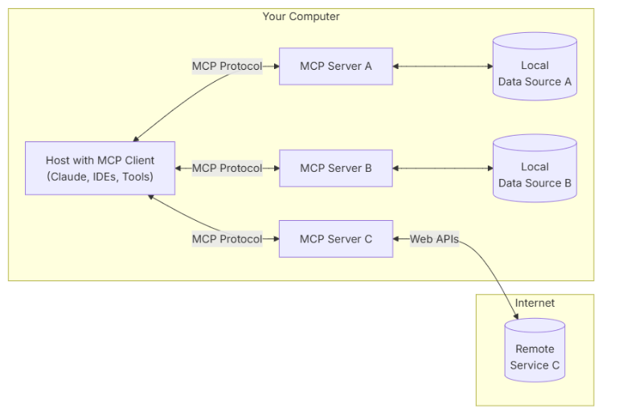

## What are AI Agents
AI agents are autonomous intelligent entities that perform specific tasks without the need for continuous human intervention
```py
env = Environment()
tools = Tools(env)
system_prompt = "Goals, constraints, and how to act"

while True:
    action = llm.call(system_prompt + env.state)
    env.state = tools.run(action)
```
**Good resource**
- https://medium.com/data-science/building-knowledge-graphs-with-llm-graph-transformer-a91045c49b59 

## Implementation Libraries and Framework
**LangGraph**
- LangGraph is a framework to orchestrate agentic workflows. It allows users to define agentic workflows as a group of nodes in a graph structure
1) Nodes: Each node represents a task, which can be one call or a series of calls to an LLM
2) Conditional Nodes: These nodes control the workflow direction, either through an if-else call or a decision by a LLM.
3) Tools: Tools can be attached to nodes. Tools are usually built by developers for specific use cases. Examples of tools include web search tools and RAG tools.

**Smolagent** 
**OpenAI Agents SDK**

**MCP**  

  

The Model Context Protocol is an open-source standard designed to facilitate connections between AI agents and various data sources, such as databases, APIs, and local files. 
Consist of:
1) Host (Application that integrates the agent, eg a chat app)
2) Client (Serves as the interface linking it to the server)
3) Server (houses the tools and handles task executioon by connecting it to databases, APIs, or local files as needed by the agent)
